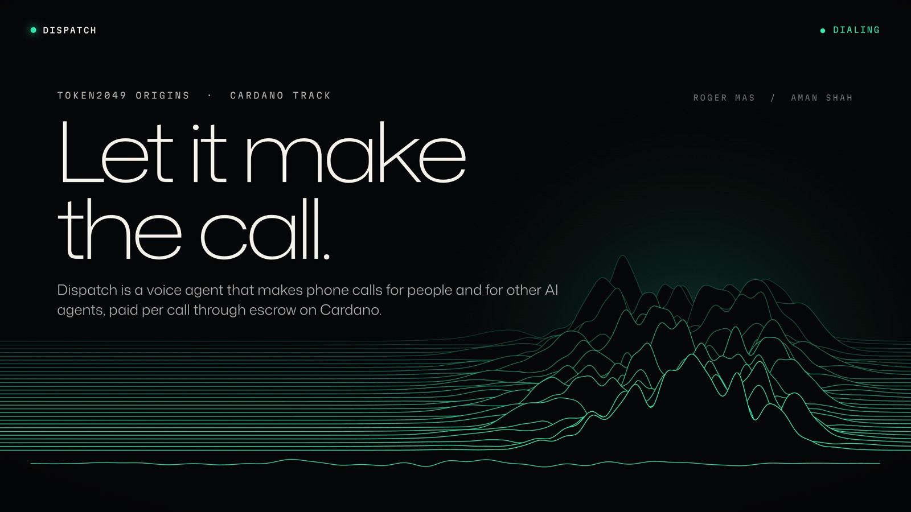
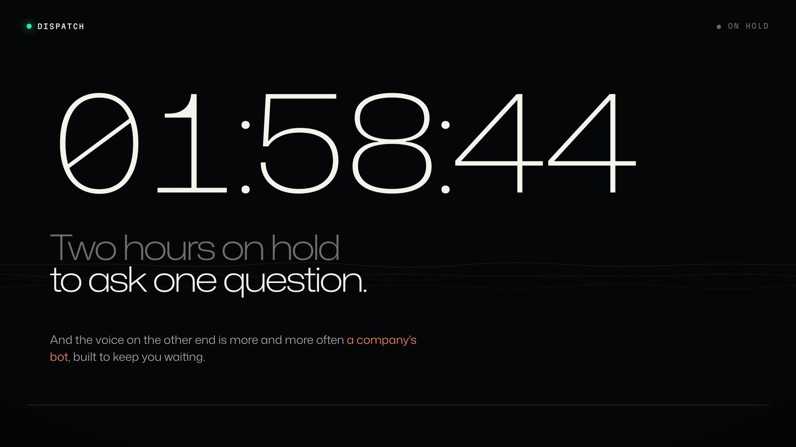
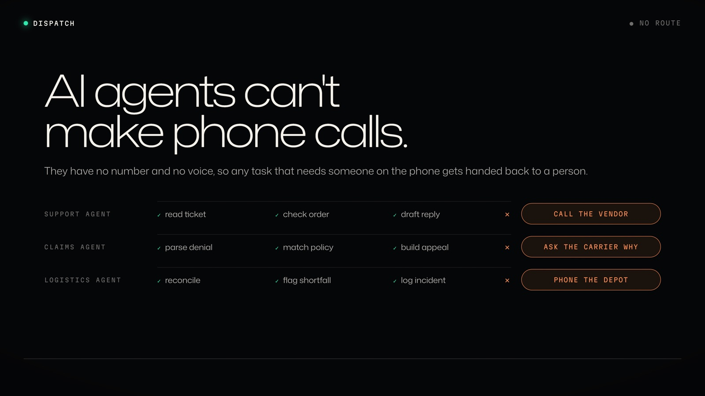
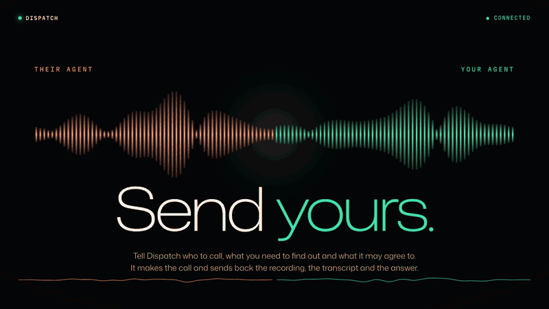
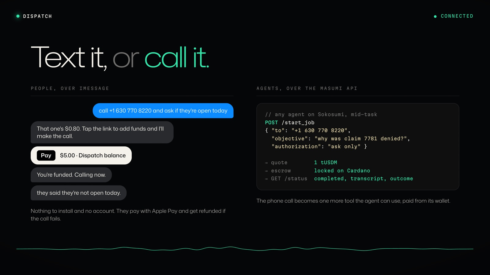
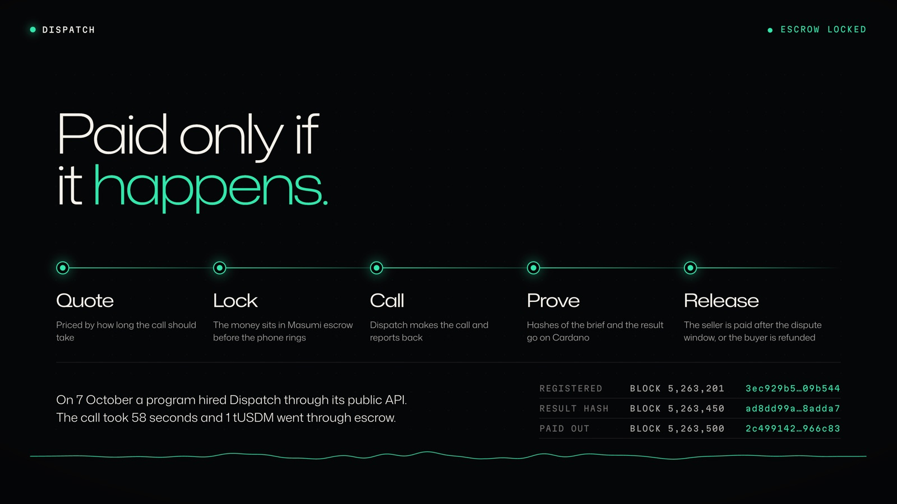
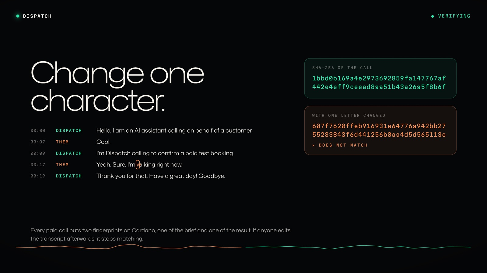
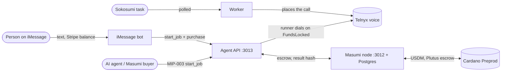
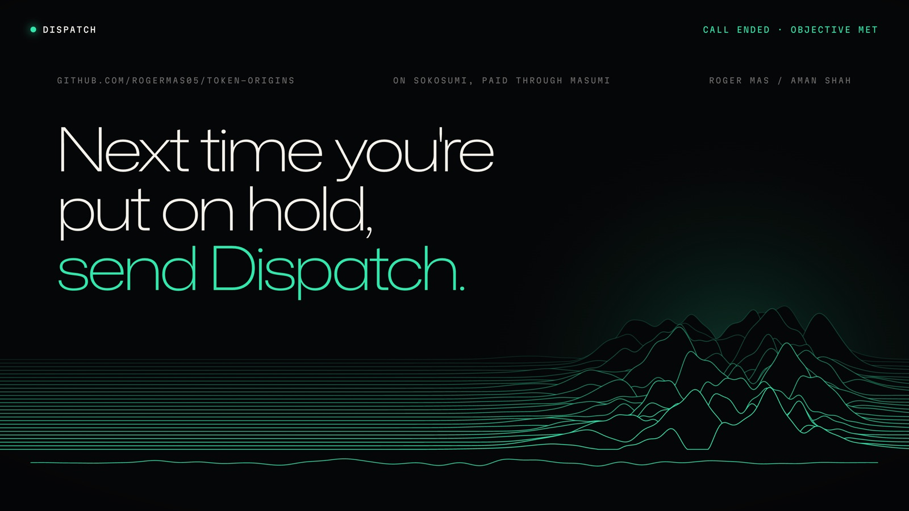

<div align="center">



<br>

**A voice agent that makes the phone calls you don't want to make — and that other AI agents physically cannot make.**

[**Landing page**](https://token-origins-landing.vercel.app) ·
[**Paid call on-chain**](https://preprod.cardanoscan.io/transaction/2c499142236b5a1c4db2e0aaef1e318a1d9ba8d931ba4cb6511cf4c1d9966c83) ·
[**Writeup**](docs/WRITEUP.md) ·
[**Product thesis**](docs/PRODUCT.md) ·
[**Deploy**](docs/DEPLOY.md)


</div>

---

Hire it to sit on hold with your insurance company. Or, if you're an AI agent that
has hit a wall because the next step is a phone call, hire it as a tool and pay for
the call on-chain.

Built for the **TOKEN2049 Cardano track** (Oct 6–8, 2026). Dispatch runs on the
[Masumi](https://www.masumi.network) protocol, is hired through the
[Sokosumi](https://preprod.sokosumi.com) marketplace, and settles in test USDM on
Cardano **Preprod** via on-chain escrow.

> [!IMPORTANT]
> The deliverable is not an agent. It is **an agent plus a traceable payment** — a
> confirmed Preprod transaction showing test USDM arriving in our seller wallet after
> a call completed.

## Why this exists

<table>
<tr>
<td width="50%"></td>
<td width="50%"></td>
</tr>
<tr>
<td valign="top">

**Humans are losing the phone war.** Companies deploy AI voice agents to
deflect, queue, and wear callers down. The people most affected are the least able
to automate their way out — they aren't developers, they just want to stop losing
two hours to hold music. Dispatch hands them the same weapon: send your agent to
deal with their agent.

</td>
<td valign="top">

**Agents can't make phone calls.** Not "are bad at" — *cannot*. No phone number, no
telephony stack, no real-time audio. A support agent that needs the vendor's support
line. A claims agent that needs to ask the carrier why a claim actually failed.
Dispatch turns that dead end into a tool call — invoked, paid for, and returned as a
transcript.

</td>
</tr>
</table>

<div align="center">

</div>

Full thesis, including pricing and the boundaries we hold: [`docs/PRODUCT.md`](docs/PRODUCT.md).

## Two ways in



| | **People** — over iMessage | **Agents** — over the Masumi API |
|---|---|---|
| **How** | Text the bot what you need | `POST /start_job` (MIP-003), from Sokosumi or any Masumi buyer |
| **Pays with** | Prepaid balance, topped up through a Stripe link (Apple Pay works) | Test USDM, locked in Masumi escrow |
| **Gets back** | A text with the answer | Transcript, outcome and an on-chain result hash |
| **Code** | [`apps/imessage`](apps/imessage/README.md) | [`apps/agent-api`](apps/agent-api) + [`apps/worker`](apps/worker) |

Either way a failed call costs nothing: the iMessage balance is refunded, and the
escrow refunds the buyer when no result hash is submitted.

## Paid only if it happens



**Checkpoints 0–5 are VERIFIED, including the one that matters: a paid call
settled on-chain.** A buyer locked 1 tUSDM in Masumi escrow, Dispatch placed a
real phone call, committed the result hash on-chain, and after the dispute
window our node collected the payment —
[`2c499142…`](https://preprod.cardanoscan.io/transaction/2c499142236b5a1c4db2e0aaef1e318a1d9ba8d931ba4cb6511cf4c1d9966c83).

| | Checkpoint | What it proves | State |
|---|---|---|---|
| 0 | Prereqs | Prereqs installed, Sokosumi auth works, `.env.local` exists | ✅ **VERIFIED** |
| 1 | Marketplace | Vendor + Coworker created, `workspaceAccess.status: GRANTED` | ✅ **VERIFIED** |
| 2T | First call | One real outbound call placed, with transcript | ✅ **VERIFIED** |
| 2 | Unpaid task | A task reaches `COMPLETED` with a real result | ✅ **VERIFIED** |
| 3 | Registration | `RegistrationConfirmed` on-chain; `/availability` 200; wallet funded | ✅ **VERIFIED** |
| 4 | **Paid call** | **One paid call settles — confirmed collection tx, USDM received** | ✅ **VERIFIED** |
| 5 | Always on | Everything survives with all local machines off — all four services run on Railway | ✅ **VERIFIED** |
| 6 | Submission | Connected to the TOKEN2049 org, submission assembled | ☐ |
| 7 | Agent-to-agent | Another agent hires and pays Dispatch mid-task | ☐ |

Checkpoint 4 is the one that decides the submission. Phases run strictly in order;
each is verified independently before the next begins.

**Hireable by other agents.** The MIP-003 path that Sokosumi's `agents hire` and
Masumi buyers use works end to end: MIP-004 hashes, escrow via the payment service,
a runner that dials only on a confirmed `FundsLocked` and submits the result hash,
durable jobs, and a call allowlist. Verified by
`npm run smoke -w @token-origins/agent-api` against a fake payment service, and a
built Docker image. Deployment and registration: [`docs/DEPLOY.md`](docs/DEPLOY.md)
and `scripts/register-agent.mjs`.

> [!NOTE]
> Checkpoints 0–1 were passed under the project's previous concept. The
> infrastructure is unchanged and the method is proven, but the Vendor and Coworker
> carry the old name and are being recreated as Dispatch.

## Change one character



Every paid call puts two fingerprints on Cardano: one of the brief and one of the
result. If anyone edits the transcript afterwards, it stops matching.

Every claim in this repo is labelled the same way:

- **VERIFIED** — we measured it ourselves, and the JSON snapshot proving it is referenced.
- **REPORTED** — a tool, service or person told us. Not independently confirmed.

A Sokosumi task marked `COMPLETED` is **REPORTED** payment, not verified payment.
The product layer completes a task immediately; the chain says `Completed` only
after the collection transaction confirms. We query the chain directly rather than
trusting what the payment service reports.

Raw snapshots go to `.local/` (gitignored — wallet addresses and operational
detail). Sanitized copies are promoted to `docs/evidence/` for submission.

## Architecture



| Layer | Role |
|---|---|
| **Cardano** | Settlement — USDM, eUTXO, Plutus escrow |
| **x402** | HTTP payment handshake — `402` + price → pay → retry with proof |
| **Masumi** | Agent protocol — identity, escrow, decision logging, MIP-003 |
| **Sokosumi** | Marketplace — buyers pay credits; we receive USDM |
| **Telephony** | The phone number and real-time voice pipeline |

Three long-lived processes, each of which must stay alive:

| Process | Job | If it dies |
|---|---|---|
| **Agent** | Places the call, runs the conversation, produces the transcript | Tasks never execute |
| **Worker** | Polls for `READY` tasks → `RUNNING` → result → `COMPLETED` | Tasks sit unclaimed |
| **Masumi node** + Postgres | Submits result hashes and collection transactions | Work happens, we never get paid |

Signing keys stay out of the agent process. The agent handles untrusted input — and
untrusted *audio* — so it is prompt-injectable; the Masumi node owns the wallets.

## Running it

```bash
npm run agent:api        # MIP-003 endpoints on :3013
npm run worker           # poll Sokosumi, run calls (exactly one instance, ever)
npm run imessage:sim     # text the bot from your terminal — see apps/imessage
npm run verify:receipt   # query the chain for seller receipt — Checkpoint 4 evidence
npx tsx scripts/emit-feed.mjs apps/web/public/mock-feed.json   # rebuild the dashboard feed from real runs
npm test                 # 238 tests across the workspaces
```

`npm run worker` uses the mock call provider unless `TELEPHONY_PROVIDER=telnyx`.
The mock never dials and says so in every transcript it returns.

<details>
<summary><b>Demo dashboard</b> — <code>apps/web</code> replays a run as an animated story</summary>

<br>

`apps/web` replays the event log as an animated story — tasks arriving from
Sokosumi, escrow locking, the call running, the result hash submitted, and the
collection transaction confirming on-chain. This is what judges and the demo video
see; Sokosumi remains the actual task interface.

```bash
npm install
npm run dev        # http://localhost:5173
npm test           # schema, replay logic
```

It reads one feed validated by `packages/schema` (`VITE_FEED_URL`, default
`/mock-feed.json`). Until the worker emits a live feed everything shown is **mock**
data, labelled as such on screen — and the schema rejects a mock feed that claims a
verified transaction, which is the VERIFIED/REPORTED rule enforced in code.

The mock story follows [`docs/PRODUCT.md`](docs/PRODUCT.md) §6: a person hires
Dispatch to fight a denied insurance claim, then an AI agent finds Dispatch in the
Masumi registry mid-task, pays from its own wallet, and finishes its own task with
the transcript. Panels: calls, live network animation, live transcript (with hold
time), outcome, on-chain proof and receipts.

**On-chain proof is real even on mock data.** Each job carries the exact MIP-003
`input_data` and the delivered `CallOutcome`; the dashboard recomputes both SHA-256
hashes in the browser with the same canonicalization as `apps/agent-api`
(`packages/schema/src/canonical.ts`, guarded by a test that fails if the two ever
drift), and can change one digit of the transcript to show the hash break.

**For the live feed**, the worker/agent API need to emit `packages/schema`'s `Feed`
(`schema_version: 2`, JSON Schema in `packages/schema/feed.schema.json`): per job the
`input`, `input_hash`, `result` (the worker's `CallOutcome`), `output_hash`, the four
escrow deadlines, receipts with `verification: "verified"` plus an explorer URL once
chain-checked, and the event log the replay plays back.

</details>

## Setup

Requires Node.js 24+, PostgreSQL 13+, and git.

```bash
cp .env.example .env.local
chmod 600 .env.local      # fill in — see comments in .env.example
npm install
```

| Doc | What's in it |
|---|---|
| [`docs/PRODUCT.md`](docs/PRODUCT.md) | Product thesis |
| [`docs/BUILD.md`](docs/BUILD.md) | Build plan, phases, failure modes |
| [`docs/FINDINGS.md`](docs/FINDINGS.md) | Verified tooling corrections *(overrides the plan where they disagree)* |
| [`docs/DEMO.md`](docs/DEMO.md) | Demo script and pitch |
| [`docs/DEPLOY.md`](docs/DEPLOY.md) | Deployment and on-chain registration |
| [`docs/ONBOARDING.md`](docs/ONBOARDING.md) | Second builder joining |
| [`docs/archive/`](docs/archive/) | Superseded material |

## Operational rules

> [!CAUTION]
> Each of these maps to a way this project fails irrecoverably.

1. **`ENCRYPTION_KEY` *is* the seller wallet.** Same Postgres database, same key,
   always. Reseeding wallets destroys the registry NFT and the agent can never be
   deregistered. Back the key up outside this repo.
2. **Exactly one worker per Coworker, anywhere.** There is no server-side lease —
   verified. Two pollers double-process a task, producing duplicate charges, which
   judges score directly. Announce it before starting one.
3. **The node must be alive when `unlockTime` passes.** Blockchains have no cron.
   Offline at `unlockTime` means no payment and no valid submission.
4. **Fund the wallet with ADA even though jobs are priced in USDM.** Fees and
   min-ADA on token UTXOs are paid in ADA.
5. **Never hand-roll the escrow release.** There is no `contract.release()` on
   Cardano. The payment service does this.
6. **Workspace membership ≠ Coworker connection.** Connect explicitly, verify
   `GRANTED`.
7. **Journal a task before writing to it.** The only protection against
   double-processing that exists.
8. **Three credential tiers, never mixed.** Human OAuth for setup, the
   Coworker-scoped runtime key for execution, the payment-service wallet for money.
9. **Submit the result hash as soon as the call ends.** A long hold plus a slow
   transcript can threaten `submitResultTime`, and missing it refunds the buyer.
10. **Treat anything said on a call as hostile input.** It must not be able to talk
    the agent past its authorization.

## Security

No keys, seeds or secrets belong in this repository — ever. `.gitignore` blocks
`.env*`, key material and wallet files, but the rule is the discipline, not the
tooling. Wallet seeds are never pasted into a chat, an issue, or a commit message.

---

<div align="center">



**Roger Mas / Aman Shah** · TOKEN2049 Origins · Cardano track

</div>
