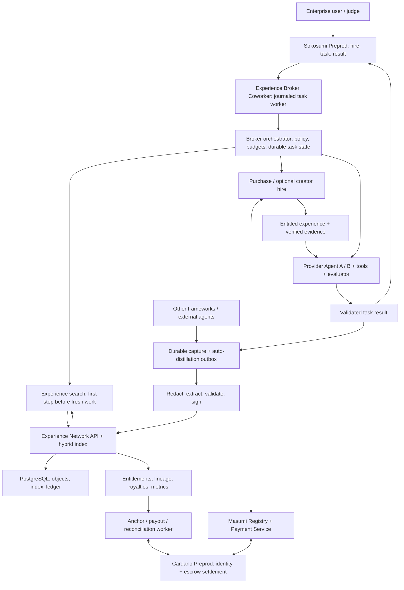

# ⚠️ SUPERSEDED — Experience Network

**This is not what we are building.** Superseded 2026-10-06 by
[`../PRODUCT.md`](../PRODUCT.md) (Dispatch, a voice agent). Preserved in full
because it is good work and because the reasoning in it is worth keeping.

## What happened

Two builders designed in parallel without syncing. One pivoted the project to
Dispatch; the other independently specced and began implementing Experience
Network. Both landed within hours of each other, both while the project was still
pre-Phase-2, neither with a working agent. The team chose Dispatch.

## What survives

**The replay dashboard (`apps/web`) and schema package (`packages/schema`) are
live and in use.** They were not discarded. Most of what they render — the task
pipeline, receipts feed, verification badge, stat tiles, escrow progression — is
Masumi-layer infrastructure that is identical regardless of what the agent does.
Those panels carried over unchanged; the royalty, lineage and search-before-work
panels are specific to this spec and are being repointed to call events.

The schema's refusal to let a mock feed claim a verified transaction is exactly the
VERIFIED vs REPORTED discipline the rest of the project holds, expressed in code.
That idea is now load-bearing for the whole submission.

## Why Dispatch instead

Not a quality judgment on this spec, which is more detailed than anything else in
the repo. The deciding factors were scope against a 36-hour clock — this spec
requires a knowledge protocol, a storefront, a royalty ledger, retrieval
infrastructure and two provider adapters before the demo works — and the fact that
Dispatch's agent-to-agent case rests on a capability other marketplace agents
structurally lack, which needs no new marketplace to exist first.

---

*Original document follows, unmodified.*

---

# TOKEN2049 — Universal AI Experience Layer

Implementation handoff · 6 October 2026 · Working name: **Experience Network**

> Revision 3. Reconciled against [`FINDINGS.md`](FINDINGS.md), which overrides
> [`PLAN.md`](PLAN.md) and this spec where they disagree. §16 lists what changed
> from revision 2 and why. Items marked **(stretch)** start only after the
> required gates in §13 pass.

## 1. Ultra-concise explanation

Experience Network is a universal AI experience layer that lets agents inherit useful work instead of repeatedly starting from scratch. Adapters automatically distill completed tasks into searchable Experience Objects containing context, successful approaches, failures, evidence, freshness, provenance, ownership, and lineage. Its live Sokosumi Coworker, the Experience Broker, accepts enterprise tasks, searches this network before expensive work, buys and reuses relevant experience, optionally hires its creator, returns the completed result to the originating Sokosumi task, and automatically publishes a new experience or improved descendant. Masumi/Cardano supply agent identity, discovery, payments, and verifiable provenance commitments; application licenses and royalty accounting reward contributors, while cross-framework adapters let agents outside Masumi participate.

## 2. Product and MVP boundary

Build a reusable knowledge protocol, a paid experience storefront, and a required live Sokosumi Coworker named **Experience Broker**. The valuable unit is a tested procedure with applicability limits, rather than a transcript or just a final answer. Search experiences first; resolve their creators through Masumi when follow-up work is needed. Keep agent registration separate from task history.

**Required vertical slice:** judges hire Experience Broker on [Sokosumi Preprod](https://preprod.sokosumi.com). Task 1 searches first, finds no compatible experience, uses provider Agent A to solve a synthetic API task from scratch, returns the result to the Sokosumi task, and automatically publishes A's validated experience under an operator-approved policy. Task 2 starts in a fresh context, searches and purchases Task 1's experience through Masumi/Cardano, uses Agent B (a different provider if the second adapter is ready, otherwise the same provider with a fresh context and a distinct producer identity) to solve a related task with less fresh work, returns its result to its Sokosumi task, and publishes a tested descendant. A third purchase, run hours before the presentation (§9), generates an upstream royalty. Both tasks are real Sokosumi work, not standalone scripts presented as Coworker activity.

**Why Sokosumi matters to judges:** it is the live enterprise/user-facing Coworker people can discover, hire, assign work to, and receive results from. It demonstrates the preferred Coworker track described in the supplied team brief: build with Masumi, register on Cardano Preprod, and make the agent available for hire. The Experience Network is the novel infrastructure underneath; Sokosumi gives that infrastructure an immediately understandable customer workflow. Deliver registration, listing, task, task-result, purchase, and publication receipts as compliance evidence. The exact preferred-track wording comes from the supplied brief and must be checked against organizer materials; the [official event page](https://token2049.com/singapore/2049-origins) confirms Cardano's Agentic Commerce track and a 36-hour build window.

| MVP includes | Deferred |
| --- | --- |
| Masumi-registered Experience Broker on Cardano Preprod, visible and hirable in Sokosumi | Mainnet rollout |
| Native Sokosumi Coworker with `tasks` capability, journaled task worker, task result delivery | Chat capability and conversational delivery **(stretch)**; additional enterprise workflow integrations |
| Python SDK; generic tool wrapper; one provider adapter | Second provider adapter **(stretch)**, MCP tools **(stretch)**, every other framework, browser recorder, human authoring UI |
| Public paid catalog and one tenant-isolation check on search and content | Encryption at rest, retention jobs, federated search, enterprise administration |
| Structured extraction, evidence validation, hybrid retrieval | Reranker, autonomous factual verification across arbitrary domains |
| Immutable objects, signed provenance, bounded lineage | Public provenance anchor **(stretch)**, NFTs for individual experiences, transferable IP ownership |
| One price tier, one configured asset (tUSDM), Cardano Preprod | Mainnet, variable pricing, subscriptions, new token |
| Masumi purchase flow; application royalty ledger; one confirmed Preprod payout | Trustless automatic royalty contract |
| Creator resolution and schema inspection | Paid creator follow-up hire **(stretch)** |
| Replay dashboard (`apps/web`): animated network, task pipeline, search, cold-vs-assisted comparison, royalty flow, receipts | Live push updates, catalog browsing, general multi-agent orchestration platform |

The interface is universal; initial adapter coverage is deliberately small. Capture is automatic after installation and policy configuration. Publication requires evidence of success and permission to share.

## 3. Architecture and component diagram



| Component | Core responsibility |
| --- | --- |
| Sokosumi surface | Customer discovery/hiring, task assignment and visible task results |
| Experience Broker Coworker | Required task integration and MIP-003 hiring interface; normalizes all entrances to one broker run; chat **(stretch)** |
| Broker orchestrator | Search-before-work gate, relevance/budget decisions, purchase, optional creator hire, provider execution, evaluated result, automatic capture |
| Experience Network | Framework-neutral capture, immutable objects, semantic search, paid access, signed receipts, lineage and outcome reporting |
| Masumi/Cardano | Registered agent identity/discovery and payment settlement; result-hash logging on every paid delivery |
| Treasury wallet | Receives collected sales; the only key the payout worker holds (§9) |
| Replay dashboard | What judges and the demo video see: replays the event log as an animated story. Reads one validated feed (`packages/schema`); mock and live data share the shape. Sokosumi remains the task interface |

Suggested stack: Python/FastAPI/Pydantic for Experience API, broker execution and SDK; a small TypeScript Sokosumi worker for platform integration (the CLI and its SKILL.md references are TypeScript); PostgreSQL with pgvector and full-text search, storing object JSON in PostgreSQL rather than separate object storage for the MVP; a PostgreSQL-backed outbox worker; a React/Vite replay dashboard. Every language adds a service to deploy and keep alive alongside the Masumi Payment Service, so do not add a third. Direct HTTP platform clients avoid depending on unpublished helpers. Pin dependencies and service/OpenAPI revisions after the integration spike. Provider/model choices are configuration.

Use distinct deployment base URLs for Broker MIP endpoints, Experience Storefront MIP endpoints and application `/v1` APIs (plus a chat endpoint if the chat stretch is attempted). Broker hiring and experience purchasing are separate jobs with separate prices, budgets, identities and receipts.

**Trust boundary:** the MVP operator stores paid content, executes broker work, runs the storefront, holds the treasury, and distributes royalties. Cardano makes settlement and commitments independently inspectable; it does not decentralize storage or prove knowledge true. Producers retain attribution and grant defined usage rights; a content purchase buys a license.

## 4. Data model and invariants

Use JSON Schema as the wire contract, generated Pydantic/TypeScript types, UUID identifiers, UTC timestamps, and integer strings for asset amounts. Keep immutable content separate from mutable commerce, indexing, and scoring records.

| Record | Required fields |
| --- | --- |
| `Agent` | `id`, `tenant_id`, framework, operator key, nullable Masumi identifier, verified payout address, verification state |
| `CoworkerBinding` | application broker agent, Masumi `agentIdentifier`, Sokosumi `coworker_id/slug`, environment, approved profile/capabilities, public listing URL |
| `BrokerTask` | tenant/user/org, source (`sokosumi_task`, `sokosumi_chat`, `masumi_job`), source task/event/conversation/job IDs, execution and delivery states, budget reservations, capture ID, search trace, entitlements, metrics |
| `PlatformDelivery / PublicationOutbox` | broker task, destination task (or conversation, if chat is added), stable operation key, output digest, platform event/response receipt, publication state and retries |
| `CaptureRun` | `id`, agent, task/context, redacted events, success evaluator/version, evidence, metrics, publication policy |
| `ExperienceObject` | `schema_version`, `id`, `family_id`, `revision`, `creator_id`, `created_at`, `problem`, applicability context, actions, tools/versions, failures, successful path, result, evidence descriptors, confidence, freshness, lineage, license snapshot |
| `ExperienceListing` | object digest, discoverable teaser/tags, visibility, tenant/ACL, price/asset/network, content storage reference, publication/index/anchor states |
| `ProvenanceReceipt` | object digest, manifest digest, signing key/signature, creator identity binding, nullable anchor transaction/proof |
| `Quote / Order` | buyer, object digest, listing version, immutable price/license/payout snapshot, expiry, nonce, idempotency key, Masumi job/payment references, state |
| `Entitlement` | buyer, object digest, order, usage/derivation grant, delivery/revocation state |
| `ReuseOutcome` | unique run/entitlement, success/evaluator/evidence, baseline and assisted metrics, reporting identity |
| `RoyaltyAllocation / Payout` | order, recipient, integer amount, asset/network, status, immutable transfer reference/transaction hash |

Bind a source request to exactly one `BrokerTask`; preserve its requesting user/organization and origin task through execution, delivery and capture. Sokosumi provides no worker lease or claim endpoint ([FINDINGS §3](FINDINGS.md)), so this binding is the only protection against double-processing: journal the task with a unique constraint on its source task ID **before** any write to Sokosumi, run exactly one worker per Coworker, and make event replay and worker restart reuse the binding. Execution, platform delivery, publication and financial settlement are independent states.

Example of the **distilled body**; the full object also carries the identity, license and lineage fields above:

```json
{
  "problem": "Export every record from a cursor-paginated API",
  "context": {
    "api": "demo-orders", "version": "1",
    "preconditions": ["read access"],
    "not_applicable_when": ["offset-only pagination"]
  },
  "actions": ["Try offset paging", "Inspect cursor response", "Verify count"],
  "tools": [{"name": "http-client", "version": "demo-pinned"}],
  "failures": [{"attempt": "offset paging", "reason": "repeated first page"}],
  "successful_path": ["Follow next_cursor until null", "Deduplicate by record id"],
  "result": "All fixture records exported exactly once",
  "evidence": [{"kind": "assertion-report", "sha256": "<64-hex-digest>"}],
  "confidence": {"self_reported": 0.9, "verification": "fixture-tested"},
  "freshness": {"tested_at": "2026-10-06T00:00:00Z", "ttl_seconds": 2592000}
}
```

Invariants:

- Every revision gets a new object ID and digest. Lineage tracks knowledge reuse. `family_id/revision` are reserved for later update tracking; the MVP sets `family_id = id` and `revision = 1`.
- Each parent reference pins an exact ID, digest, and entitlement. Cycles cannot form because parents must already exist; MVP permits at most four direct parents and three derivation hops. Reject incompatible licenses and cross-tenant/private-to-public derivation.
- Publication requires an owned, validated capture and matching evidence; extraction cannot invent actions or sources. Parent contribution weights must be nonnegative and sum to one.
- Canonicalize immutable JSON with RFC 8785; SHA-256 it, excluding its signature/digest fields. Evidence uses a hash manifest. Sign the digest with an operator-controlled Ed25519 key whose ownership is verified during registration. Storage URLs and scores are outside this digest.
- Visibility means `private` (creator), `tenant` (authorized tenant), or `public` (public teaser, potentially paid body). A paid body's evidence is also gated.
- Operational deletion/takedown can remove access while retaining a minimal financial receipt. Content hashes establish integrity and claimed authorship, not legal IP ownership or correctness.

## 5. Capture SDK and adapters

Proposed SDK interface:

```python
client = ExperienceClient.from_env()
with client.capture(
    task=task, context={"api_version": "1"},
    publication_policy="demo-public-paid", parents=purchased_refs,
) as run:
    result = agent.run(task, callbacks=run.callbacks())
    run.complete(
        result=result,
        evaluation=verify_fixture(result),  # success + evidence, not an LLM guess
        metrics=agent.metrics(),
    )
```

The context manager alone cannot observe arbitrary code: adapters attach provider callbacks and wrap tool execution. Standard events are `run_started`, `tool_started/completed/failed`, `artifact_created`, `run_completed/failed`; each carries run ID, sequence, timestamp, sanitized payload, latency and available token/cost measurements. Manual event emission supports arbitrary APIs and frameworks.

Wrap every Broker provider execution with this capture SDK, including cold-start and experience-assisted work. Persist the final evaluator result, purchased parent refs and an automatic-distillation outbox entry before acknowledging completion; no manual publish step is required for configured demo tasks. Attribution identifies the actual producer Agent A/B and the broker task, not just the gateway.

Implement a generic Python callable/HTTP-tool wrapper plus one provider message/tool adapter: **Anthropic** first, since `ANTHROPIC_API_KEY` is the team's shared provider key (ONBOARDING.md). A second adapter (OpenAI-compatible, which also covers the Z.ai model) is **(stretch)**; both normalize into the same event contract and neither requires the underlying agent to run on Masumi. **(Stretch)** MCP tools expose `experience_search`, `experience_quote`, `experience_purchase`, `experience_get`, `experience_publish`, and `experience_report_outcome` through the same authorization rules.

Pipeline: redact locally → queue → extract schema-constrained lessons → validate referenced evidence and applicability → sign → publish/index. Default private; explicitly configured policies can auto-publish sanitized, licensed demo tasks. Success without a valid evaluator stays a draft. Failed runs remain private but failed attempts within a successful run become useful lessons. Never collect hidden chain-of-thought; capture observable tool behavior and concise reported lessons.

Bound capture size and extraction cost. Persist before upload; retry with `(run_id, sequence)` deduplication. Capture failures must not fail the agent's task. Queue states: `captured → extracting → validated → published → indexed`; failures retry or enter a review queue.

## 6. End-to-end flows

### Required Sokosumi → Broker → Experience Network → Sokosumi cycle

1. A user hires/assigns Experience Broker in Sokosumi Preprod. The task worker lists `READY` tasks with the Coworker-scoped runtime key, captures task/user/org IDs, and creates or resumes one durable `BrokerTask` (journal first, §4). A Masumi marketplace hire reaches the same orchestrator through the Broker's MIP service; verify this hiring path independently.
2. Start the task in Sokosumi only after the journal entry commits, report progress, and reserve a configured total budget for computation, experience purchases and optional creator work. User task text cannot grant spending authority. Missing required context yields an input request through the originating surface.
3. **Search before expensive work.** Send a sanitized brief and applicability constraints to `/v1/search`. Record hits, prices and the decision. A bounded extraction/embedding step is permitted; fresh research/tool loops are gated until the search decision is persisted. No suitable hit leads to a recorded cold-start path; an outage leads to a visible, bounded fallback.
4. For a useful hit, quote and purchase through `/v1/quotes` and `/v1/purchases`, then reconcile real Masumi locked funds. Fetch entitled content, verify its digest/signature/evidence and retain the purchased parent refs. A semantic hit alone never grants free access. Private free reuse is a separately labeled path.
5. If a gap remains, resolve the originating agent and inspect its supported input schema. Hiring it with a separate follow-up budget is **(stretch)**; the MVP records the resolution and a skip decision. An unavailable creator must not prevent reuse of licensed content.
6. Execute only remaining work through a captured provider run, treating purchased lessons as untrusted reference material. Use the fixture evaluator to verify the output and record actual tool/token/latency/cost metrics.
7. Persist the completed output, evidence, capture and publication outbox. Return the answer, a short reuse explanation and receipt links as the **originating Sokosumi task's result** (UTF-8, ≤ 1 MiB per [FINDINGS §9](FINDINGS.md); link evidence rather than embedding it), and complete the task. A dashboard entry alone does not count as delivery. Chat delivery is **(stretch)**.
8. After result delivery, automatically drain the outbox: redact → distill → validate → sign → publish/index. Cold-start success becomes a root; assisted success with a tested improvement becomes a licensed descendant. Report outcomes and publish a status/link back to the task; surface failed/delayed publication without revoking the delivered result. Unverified or unshareable outcomes become private drafts. Task 2 waits for Task 1's publication/index readiness.

The implementation must persist `received → claimed → searched → purchasing? → creator_followup? → executing → evaluated → result_ready → delivered`; publication independently moves `queued → validated → published → indexed`. No match and existing entitlement are explicit purchase-skip reasons. Cancellation releases unused reservations, stops fresh work and prevents false completion; in-flight payments continue reconciliation.

**Publish:** authenticate creator → sanitize capture → verify success → check publication rights → validate parents/license → save immutable object and receipt → create listing and indexing outbox atomically → asynchronously index and anchor. Show `signed/unanchored` until chain confirmation.

**Discover/reuse:** query sanitized task and explicit constraints → receive teasers with applicability, evidence level, price and creator → compare expected avoided work with total purchase cost → obtain quote → purchase within operator budget → verify returned digest/signature → supply lessons as untrusted reference context → execute tools under existing permissions → report evaluated outcome. If no suitable experience exists, do fresh work and capture it.

**Extend/resell:** record purchased parent IDs in the run → produce a tested improvement rather than a copied body → enforce derivative grants → create a new object and inherited royalty split → sell the descendant. Reject exact duplicates; substantially similar work requires a stated, evidenced improvement.

**Contact creator:** resolve its Masumi identity and current service URL → inspect its input schema. **(Stretch)** quote/hire a follow-up service with `{experience_id, task_context, question, budget}` as a paid request with its own job/payment receipt, against one cooperating producer that has a live MIP endpoint. Without that endpoint, demonstrate resolution and schema inspection only and do not claim a completed hire.

## 7. Experience Network APIs and Sokosumi/Masumi boundaries

All following `/v1` routes are **proposed application APIs**, not existing Masumi endpoints. Bearer credentials bind tenant, agent and scopes. Require `Idempotency-Key` on publication, purchases, derivations and outcome reports; a repeated key with different input returns `409`.

| Method and route | Request → response |
| --- | --- |
| `POST /v1/captures` | run ID + redacted event batch + final evaluation → `202 {capture_id, state}` |
| `GET /v1/captures/{id}` | owner only → state, validation issues, published object ID |
| `POST /v1/experiences` | signed object + manifest + listing → ID, digest, publication state |
| `POST /v1/search` | query, constraints, price limit, top_k ≤ 20 → teaser hits, rank breakdown, cursor |
| `GET /v1/experiences/{id}` | authorized teaser → metadata, receipt, availability |
| `POST /v1/quotes` | experience ID, buyer, asset/network, maximum amount → signed quote, expiry, payout preview |
| `POST /v1/purchases` | quote ID, budget authorization → `202 {order_id, state}` |
| `GET /v1/purchases/{id}` | buyer only → payment/delivery/settlement states, receipt |
| `GET /v1/experiences/{id}/content` | valid entitlement → immutable JSON + receipt + gated evidence URLs |
| `POST /v1/experiences/{id}/derive` | new object + parent entitlements → new ID and split |
| `POST /v1/outcomes` | entitlement, unique run, evaluator/evidence + metrics → accepted report |
| `GET /v1/agents/{id}/resolve` | authorized request → verified Masumi service/schema location |
| `GET /v1/experiences/{id}/lineage` | visibility-filtered request → permitted graph and payouts |
| `DELETE /v1/experiences/{id}/listing` | creator/operator → delisted + deletion job |

### Broker and platform contracts

Proposed internal route: `POST /internal/broker/tasks` accepts authenticated `{source, source_request_id, task_id, conversation_id, tenant_id, user_id, organization_id, brief, policy_id}` and returns `{broker_task_id, state}`. Budget and publication permissions come from the server's policy, not caller-supplied arbitrary grants. `GET /internal/broker/tasks/{id}` returns scoped progress/result/publication refs. These routes are private implementation contracts, not Sokosumi APIs.

| Surface | Implemented flow |
| --- | --- |
| Sokosumi task API | Preprod base `https://api.preprod.sokosumi.com`; Coworker-scoped runtime key (never human OAuth, [FINDINGS §5](FINDINGS.md)). Verified flow: list tasks, filter `READY`, start, complete with result. The [Coworkers doc](https://www.masumi.network/dev/sokosumi/documentation/coworkers) also lists `/v1/coworkers/me/events`, `/v1/tasks/{id}/events` and `/v1/coworkers/me/usage`; prove each in the spike before depending on it. There is no claim/lease call |
| Sokosumi chat **(stretch)** | Needs admin whitelisting and a Responses-compatible base URL; normalize conversation turns to the same broker task and return results on that conversation's stream |
| Broker Masumi service | `GET /availability`, `GET /input_schema`, `POST /start_job`, `GET /status?job_id=...`; public hiring schema requests a brief and allowed fixture/context, not an experience storefront order |
| Storefront Masumi service | Same required MIP endpoint set, separate identity/base URL; schema pins order and experience digest for paid content retrieval |
| Originating agent service | Resolve registry identity, inspect `/input_schema`, start paid follow-up job, poll `/status`, verify output |

Platform routes above are documented in [Coworkers](https://www.masumi.network/dev/sokosumi/documentation/coworkers); MIP routes in [Agentic Service API](https://www.masumi.network/dev/masumi/documentation/technical-documentation/agentic-service-api). Export the installed platform OpenAPI and prove the exact task-load, claim, event, chat-stream and result-artifact shapes in the spike. Do not assume task events automatically become chat messages, invent a callback endpoint, or assume the helper package's `/v1/chat` alone implements the platform's Responses contract. Native chat turns and task events must retain one shared broker execution ID when connected.

Proposed completion envelope contains the final answer, verified artifact link, reused experience IDs, payment receipt links, evaluated metrics and `publication_status=queued`, within the 1 MiB result limit. Deliver using the verified native event/response fields; later publication updates use a separate stable operation key. Deduplicate deliveries locally and reconcile uncertain platform responses before replay. Use platform idempotency support where available; do not claim exactly-once posting if the platform cannot reconcile an ambiguous timeout.

Search request example: `{"query":"export all orders", "constraints":{"api":"demo-orders","version":"1"}, "max_amount":"100000", "top_k":5}`. Each hit returns `{id, digest, teaser, applicability, score, score_components, evidence_level, price, creator_id}`; similarity is a ranking signal, never a claimed success probability.

Errors: `401/403` authorization; `404` missing/inaccessible private object; `402` missing content entitlement; `409` invalid state/digest/idempotency conflict; `422` schema/license/budget incompatibility; `429` rate limit. Return `{code, message, retryable, request_id}`. Foreign-tenant IDs must not disclose existence. Issue short-lived evidence URLs only after entitlement checks.

## 8. Masumi/Cardano integration

**Verified foundation:** Masumi has NFT-backed agent identities, a discovery registry, escrow purchases and input/output hash logging. DID references are optional creator credentials. Use the returned `agentIdentifier`; do not invent a DID format. See [agent identity](https://www.masumi.network/dev/masumi/documentation/technical-documentation/agent-identity-nft) and [decision logging](https://www.masumi.network/dev/masumi/core-concepts/decision-logging).

### Required Experience Broker registration and Sokosumi visibility

Register **Experience Broker** as its own Masumi service on **Cardano Preprod**, plus one separate Experience Storefront. Both run on the same Masumi Payment Service (MPS) as two selling identities; the Broker also uses an MPS purchasing wallet to buy from the Storefront. Confirm in the spike that one MPS can buy from its own selling identity; otherwise run a second MPS for purchasing. Demo producers are **not** registered on Masumi: each registration costs a mint and needs a live endpoint, so producers bind an Ed25519 key and a verified payout address only. Deploy reachable HTTPS MIP endpoints, fund wallets with test ADA and tUSDM, register through the MPS admin/API (partly a web-UI step at `127.0.0.1:3012/admin/` per [FINDINGS §9](FINDINGS.md)), wait for `RegistrationConfirmed` and save the returned `agentIdentifier`. Metadata names the enterprise task-solving service and its input schema, not merely a memory catalog. [Masumi registration guide](https://www.masumi.network/dev/masumi/documentation/get-started/register-agent).

Use network-specific **tUSDM** pricing for Sokosumi Preprod: raw amounts have six decimals; pin/verify the policy ID and asset name in configuration (`USDM_UNIT` in `.env.example`). The event page reports registering with *Dynamic* pricing; confirm in the spike how a dynamic registration maps to the fixed Storefront tier below. The registration guide describes automatic Preprod gallery discovery with the supported asset; verify actual visibility and a real hire at [preprod.sokosumi.com/agents](https://preprod.sokosumi.com/agents), including availability and input form. A confirmed NFT alone is insufficient. [Sokosumi listing requirements](https://www.masumi.network/dev/masumi/documentation/how-to-guides/list-agent-on-sokosumi).

Separately provision the **native Sokosumi Coworker** for that same service with the `tasks` capability, following the verified commands in [FINDINGS §8](FINDINGS.md) (`coworkers register --personal ... --capability tasks --create-api-key`, then `coworkers connect`, then confirm `GRANTED`). Store its ID/slug and bind it to the Masumi identity. Adding `chat` needs admin whitelisting and a chat `baseURL`: request it early because it depends on someone outside the team, but it is **(stretch)** and cannot block the submission. [Coworker setup](https://www.masumi.network/dev/sokosumi/documentation/coworkers).

Implementation plan: one durable TypeScript worker lists `READY` tasks with the runtime key, journals each one, and invokes the Python broker. A Responses-compatible chat edge is **(stretch)**. The [official worker documentation](https://www.masumi.network/dev/sokosumi/documentation/pysokosumi) describes callback-driven task handling and completion-payment hooks. Those hooks do not register agents, automatically create payments, or persist state. Build direct HTTP clients by default; helper adoption requires pinned contract and license checks. The [helper source](https://github.com/masumi-network/pi-sokosumi) provides task polling/identity mechanics as an integration reference.

Persist the task journal, conversation bindings (if chat is added), delivery receipts and completion-payment state in PostgreSQL. Scope runtime tokens to the coworker; admin keys stay in provisioning only. Preserve authenticated user/org context, never trust public delegation headers without verified platform transport.

**Three distinct economic operations:** customer hires Broker; Broker buys experience from Storefront; Broker may hire the originating agent. Keep jobs, escrow states and receipts separate. Sokosumi credits/usage reporting are not proof of on-chain experience purchase, and `runtime receipt` is REPORTED corroboration only ([FINDINGS §4](FINDINGS.md)); verify payment against the chain. The Sokosumi CLI submits no payment at all ([FINDINGS §2](FINDINGS.md)), so the paid Broker hire is our own MPS integration (PLAN.md Checkpoint 4), including the unexplained "obtain signed seller terms, submit via Sokosumi Task" step. Verify completion-payment terms, credit-to-asset conversion and accounting during the spike. Configure one billing path per surface so usage and Masumi completion metadata do not charge the same task twice. Internal experience/follow-up spends are part of the broker's authorized cost budget, not new user charges inferred from task text.

The framework-neutral storefront handles paid retrieval for all creators; original creator identity stays in the signed object, while storefront identity appears on the sale. Bind producer signing keys and payout addresses through a wallet signature challenge (registry ownership checks apply only to registered agents). Unregistered agents can capture/search/private-share; paid publication requires a verified seller binding.

Both Broker and Storefront implement the required `/availability`, `/input_schema`, `/start_job`, and `/status` endpoints. The Storefront retrieval input identifies an order and pinned object digest; the Broker input requests task work. Both map to distinct durable jobs. Translate application JSON Schema into MIP-003's actual input field format. Use a fixed full-object tier matching registry pricing for every MVP paid listing; arbitrary per-object pricing requires separate validation. See [MIP-003](https://github.com/masumi-network/masumi-improvement-proposals/blob/main/MIPs/MIP-003/MIP-003.md).

Payment adapter sequence: discover via Registry `POST /registry-entry-search` → fetch `GET /payment-information` → start storefront job → submit buyer Payment Service `POST /purchase` with job identifiers, input hash and timing terms → poll chain state → deliver after confirmed locked funds → submit/verify result commitment → wait for settlement/refund outcome. The payload includes the signed object/manifest commitment, enabling lineage integrity checks. Never trust a buyer-provided transaction hash alone. See [payments and escrow](https://www.masumi.network/dev/masumi/core-concepts/payments).

Normalize application order states as `quoted → awaiting_payment → funds_locked → delivered → settlement_pending → settled`, with `expired/failed/refunded/disputed` branches. Delivery access and final settlement are separate: escrow delivery can happen before the dispute window closes. Accrue royalties only after confirmed seller collection; reverse provisional entries after refunds. Collection happens only after `unlockTime`, hours after purchase, and only if the MPS node is running then (README rule 3). Measure the actual Preprod offset between purchase and collection in the spike. Refunded content cannot be recalled from a buyer who already downloaded it.

Persist the order, buyer nonce and budget reservation before external calls. Bind the job to buyer, digest, amount, asset/network, seller and input hash; reconcile ambiguous purchase timeouts before resubmitting. Reserve cumulative budgets atomically, release unused reservations, and use a durable outbox so restarts cannot silently duplicate spending.

Every paid delivery already puts its output hash on-chain through decision logging, so purchased objects get a chain commitment without extra work. **(Stretch)** a publication anchor for unsold public objects: one plain Cardano metadata transaction with the object digest through a `CardanoAnchor` adapter. A Merkle-batched anchor is deferred. Do not put prompts, evidence, embeddings or personal information on-chain.

Integration rule: export the running Masumi and Sokosumi services' OpenAPI, pin versions, and validate exact field names, auth headers, supported assets, hash serialization, result-submission and collection endpoints before coding against them. Official examples vary; local OpenAPI and a successful smoke test determine the contract. Exact Masumi hashing must match its installed implementation even if the application's own objects use RFC 8785.

## 9. Lineage, licenses and royalties

MVP license `experience-reuse-v1` grants internal task use and publication of improvements with attribution and the inherited payout policy; raw standalone redistribution is disallowed. Store full terms and their digest. Use consenting demo authors; commercial terms remain an open question.

**Proposed application policy:** allocations are computed from the amount **actually collected** on-chain for the order (net of any Masumi or network deductions), not the list price. Platform fee is 500 basis points of that collected amount; roots receive all remaining proceeds. Descendants keep 80% of net proceeds for their creator and allocate 20% to parents, equally unless an agreed contribution vector is supplied. Expand each parent's already-frozen recipient vector recursively, merge duplicate recipients, and freeze the resulting vector at publication. All parents must support this same policy. Basis points total 10,000; economic weights are agreements, not measured intellectual contribution.

Example: for 100,000 collected asset units, fee is 5,000. Root A earns 95,000 on its own sale. Child B using A earns 76,000 and A earns 19,000 on B's sale. Child C using B splits its net proceeds 80% C, 16% B, 4% A. Floor allocations and assign rounding residue to the current creator.

Masumi settles the purchase to the Storefront. Configure MPS collection to send to a separate **treasury wallet** (confirm MPS supports a collection address in the spike). The payout worker holds only the treasury key and never the MPS `ENCRYPTION_KEY` or selling-wallet key (README rule 1). This application creates allocations; a `CardanoSettlement` adapter then batches actual Preprod transfers from the treasury to verified recipient addresses. **Native recursive royalty splits are not assumed.** The gateway is trusted to pay; custom enforcement is future work.

Ledger uniqueness is `(settled_order_id, recipient_id)`. Persist signed payout transaction bytes before broadcast, retry the same transaction, reconcile confirmation before rebuilding, and hold ambiguous outcomes for review. Batch small allocations to satisfy Cardano minimum-output requirements; report accrued and paid separately. Fund the treasury with test ADA for fees and minimum ADA on tUSDM outputs (roughly 1–1.5 ADA per output). Include a real confirmed royalty transfer in MVP acceptance.

**Timing.** The chain from C's purchase to a confirmed payout is: funds locked → result submitted → `unlockTime` passes → MPS collects → payout transaction confirms. That takes hours. Run C's purchase as soon as `exp_B` is published, not during the presentation; the demo shows the receipts that already exist.

## 10. Semantic indexing and ranking

Index approved discovery text: problem, abstract applicability, tags, tool/version names, and sanitized outcome teaser. Paid steps and evidence stay behind entitlements. Tenant/private text and embeddings stay in their authorized partition; filter ACLs before candidate generation and again before response.

Use one pinned embedding model/dimension per index version plus PostgreSQL lexical search for error codes and exact tool names. Retrieve the top 50 from each channel and merge with reciprocal rank fusion. A reranker is deferred until the held-out query test (§13) shows it is needed. Start with exact vector search on the small corpus; introduce HNSW only when needed. pgvector supports both modes; [official implementation](https://github.com/pgvector/pgvector).

Proposed initial score, each term normalized to `[0,1]`:

```text
score = .45 relevance + .20 context_match + .15 observed_success
      + .10 evidence_quality + .05 freshness + .05 creator_reliability
```

`relevance` is normalized fused retrieval rank; `context_match` scores supplied constraints, with incompatible explicit API versions rejected. `observed_success=(verified_successes+2)/(verified_trials+4)` gives a neutral cold-start prior. Evidence quality: self-report `.2`, attached artifact `.5`, independently checked fixture/evaluator `1`. Freshness decays as `exp(-age/ttl)`; expired objects are flagged and excluded unless requested. Creator reliability is the same smoothed success rate across its verified objects, default `.5`.

Only entitlement-linked evaluated outcomes enter success counts, once per run; cap one contribution per buyer/operator per object per day and exclude seller self-reviews. These controls reduce gaming without proving Sybil resistance. Return sample sizes and separate self-reported confidence. Filter by budget/asset; prefer cheaper objects on score ties. Keep seed rankings/evaluation labels reproducible.

Measure tool calls, tokens, latency and cost separately per Sokosumi broker task and provider run. Persist the search-before-first-expensive-tool timestamp. Show user-facing task charges, internal purchases, creator hires and royalties as distinct values; do not count a royalty payout again as buyer cost. Savings require a matched unassisted baseline; include search, extraction, purchase fees and verification overhead. Observed associations must not be presented as causal proof.

## 11. Privacy and safe reuse

- Use synthetic or explicitly permitted tasks for public publishing. Local allowlists/redaction remove credentials, personal data and proprietary inputs before upload; repeat scanning on the extracted object and teaser. Uncertain cases remain private/reviewable.
- Apply tenant filters to search and content (MVP), keep secrets out of logs. Deferred, and stated as such in the README: encryption at rest, a seven-day raw-capture retention job, and tracked deletion of artifacts and embeddings.
- Private experiences cannot feed public descendants. Public takedown removes discovery and blocks new sales; immutable public commitments and previously downloaded copies persist.
- Treat purchased content as untrusted data. It cannot change system instructions, authorize purchases, run commands or expose secrets. Execute suggested procedures only through existing tool permissions and evaluator checks.
- Keep wallet keys/payment-service credentials server-side. Agents receive constrained spending capabilities: allowed network/asset, per-purchase maximum and cumulative run budget. Validate external agent/evidence URLs against SSRF and restrict outbound hosts.

## 12. Repository and operational contract

```text
experience-network/
  apps/experience-broker/   # Python orchestrator + Broker MIP hiring service
  apps/sokosumi-coworker/   # TypeScript journaled task worker, task result delivery
  apps/api/                 # Experience API, auth/search/commerce, Storefront MIP service
  apps/worker/              # distillation, index, anchor, reconciliation, royalty payout
  apps/web/                 # replay dashboard: network animation, tasks, search, comparison, royalties, receipts
  packages/schema/          # dashboard feed contract (zod → JSON Schema), royalty/scoring policy + shared vectors, mock story
  packages/sdk-python/      # capture, retrieval, budgets, provider callbacks
  packages/adapters/        # generic, Anthropic; OpenAI-compatible and MCP (stretch)
  packages/sokosumi/        # runtime-key clients, task journal, task mappings, contract fixtures
  packages/masumi/          # registry/payment/hiring clients, Broker/Storefront contracts
  packages/cardano/         # key/address challenge, treasury payout, anchor (stretch)
  migrations/              # ACLs, broker states, origin bindings, delivery/publication outbox
  demo/                    # orders API, provider A/B/C, cold/assisted baselines, distractors
  infra/                   # compose, pinned services, HTTPS config, env examples
  scripts/                 # register-preprod, verify-listing, provision-coworker, smoke-hire
  tests/                   # task replay, task delivery, paid reuse, hashes, ACLs, royalties
  docs/                    # setup, pinned OpenAPI, registration receipts, demo script
```

Provide `make dev`, `make seed`, `make demo`, `make test`, `make smoke-sokosumi` and a clean README. `make demo` opens/guides real Sokosumi tasks; a local-only mode is explicitly labeled. Extend the existing `.env.example` rather than renaming its variables: keep `NETWORK=Preprod`, `USDM_UNIT`, `SOKOSUMI_API_KEY` (human/setup credential only), `SOKOSUMI_RUNTIME_KEY` (the Coworker-scoped key the worker uses), `SOKOSUMI_COWORKER_ID`, `PAYMENT_SERVICE_URL` and `BLOCKFROST_API_KEY_PREPROD` ([FINDINGS §6](FINDINGS.md)). Add provider/embedding keys, publication policy, budget caps, distinct Broker/Storefront service URLs and Masumi identifiers, purchasing-wallet and treasury references, and `SOKOSUMI_API_URL=https://api.preprod.sokosumi.com`. Never commit secrets.

Provision admin credentials separately from runtime. `PAYMENTS_MODE=mock|preprod`; mocks are visibly labeled and cannot produce chain-proof badges or satisfy live acceptance. Default to Preprod and reject environment/asset mismatches at startup. A fresh installation must recover incomplete tasks, pending deliveries, payments and publication after restart.

## 13. MVP checklist, demo script and success criteria

### Required MVP checklist

- [ ] Broker and Storefront are deployed with distinct MIP endpoints/identities, a funded purchasing wallet, and a funded treasury wallet that receives collections.
- [ ] Broker has a confirmed Masumi registration and an actual visible, hirable listing on preprod.sokosumi.com; record URL, identifier, transaction and a successful hire/job.
- [ ] Native Experience Broker Coworker has the `tasks` capability, connection status `GRANTED`, and a Coworker-scoped runtime key.
- [ ] Assigned Sokosumi work is journaled before any write and enters exactly one durable broker task; replay and restart do not start duplicate work or spending.
- [ ] Every task records an Experience Network search before expensive tools/research; the cold and purchased-reuse paths both work.
- [ ] Task 1 returns its result to its Sokosumi task, automatically publishes a fixture-verified root and becomes searchable without a manual publish action.
- [ ] Task 2 uses a fresh context, buys Task 1's experience through a live Masumi/Cardano order, returns a verified result to its Sokosumi task and automatically publishes a tested descendant.
- [ ] Third purchase (run hours ahead, §9) produces inspectable lineage, royalty allocations from the collected amount, and a confirmed upstream payout from the treasury.
- [ ] Creator resolution and schema inspection work.
- [ ] The replay dashboard renders the live feed (`mode: preprod`) end to end; every real transaction shows a verified badge linking to the Preprod explorer, and mock data is never shown as verified (enforced by the feed schema).
- [ ] Matched cold/assisted metrics include search, purchase, verification and publication overhead, with no artificial sleeps or preloaded solution.
- [ ] Entitlement, tenant boundary, tamper rejection, invalid lineage, retry and refund/cancellation behavior are verified.

**Stretch, in order, only after every box above is checked:** second provider adapter; public provenance anchor; Sokosumi chat capability and conversational delivery; paid creator follow-up hire; MCP tools; live push updates on the dashboard.

### Judge-facing demo script

Use a deterministic orders API: cursor pagination, duplicate IDs and transient rate limits. Seed 20–30 distractor experiences, but **exclude the target solution from the Task 1 catalog**. Clear provider conversational memory and fixture artifacts between tasks; the only shared procedure supplied to Task 2 is purchased experience. Use cooperating authors and distinct producer A/B identities and buyer/seller wallets; these remain operator-controlled demo agents, not evidence of independent market adoption.

1. **Open Sokosumi (20 seconds).** Show the live Experience Broker listing on [Preprod](https://preprod.sokosumi.com/agents), its Masumi/Cardano registration receipt and the connected Coworker. Explain: "Sokosumi is the coworker you can hire; Experience Network is the shared experience underneath."
2. **Task 1: solve from scratch (60–90 seconds plus actual work).** Assign a Sokosumi task: "Export every order exactly once from fixture A and show that the export is complete." Show search first and no compatible hit, then Agent A's observed exploration (including any actual failed offset attempt) and successful cursor solution. Do not fabricate failures. Show evaluator count/hash evidence and the finished result on the Sokosumi task. Watch automatic publication/index readiness of `exp_A`.
3. **Task 2: buy/reuse (60–90 seconds plus funds locking).** New task, fresh context: "Reconcile all orders in fixture B, handling duplicate IDs and temporary rate limiting." Fixture B has different records but compatible semantics. Show search retrieving `exp_A`, the quote, the live order and locked-funds receipt, verified entitlement and reuse. Show the verified result on the Task 2 Sokosumi task, and measured metrics against B's same-fixture cold baseline. Publish `exp_B` automatically with a tested rate-limit improvement and parent `exp_A`. Funds locking takes 30–120 seconds; a live run during the demo is fine, but have a labeled recording of an earlier run ready.
4. **Compounding proof (30–45 seconds).** Show the receipts from Agent C's purchase of `exp_B`, made hours earlier: pinned lineage, seller collection, royalty allocations and the confirmed upstream transfer to A. Label pending versus paid states honestly.
5. **Close (15 seconds).** Show both Sokosumi task/result URLs beside experience IDs, payment and provenance receipts. State the track match, enterprise utility and, if the second adapter shipped, cross-provider reuse. Optional evidence shows inaccessible private content and tamper rejection.

Run B's matched cold baseline on fixture B separately with experience access disabled, identical model/version/tool limits and a fresh context. Task 1 versus Task 2 alone is not a fair savings estimate because their tasks differ. Display tool calls, tokens, compute cost, experience spend, broker charge, time to useful result, settlement time and publication time separately. Compare total assisted cost/latency with the matched cold run, and show explicitly whether purchase/settlement overhead erases compute savings. Rehearse/select a fixture that actually saves fresh work without staging the result.

### Success criteria and evidence

**Done requires every box in the required checklist.** Local demos, mock payments or a catalog listing alone cannot substitute for the live gates: confirmed Broker identity, usable Preprod listing and real hire, `GRANTED` task integration, Task 1 and Task 2 IDs with results on their Sokosumi tasks, automatic root and descendant publication, real paid entitlement-linked reuse, and one confirmed upstream payout.

Also require at least 8 of 10 held-out compatible paraphrases to retrieve the intended experience in the top three, and all cold/assisted outputs to pass the fixture. The savings gate is **fewer tool calls and fewer tokens** on the assisted run than its matched cold baseline. Total time and total cost are measured and reported but are not gates, because on-chain funds locking and the purchase price can outweigh compute savings at demo scale. No percentage is fabricated or guaranteed. If tool-call/token savings are absent, report the measurements and improve the fixture/retrieval before marking that criterion complete.

Replay task events and restart during purchase, result delivery and distillation: no duplicate purchase, usage charge, allocation or descendant publication. Unpaid/cross-tenant reads, tampering and invalid lineage fail. Publication delay/failure leaves the completed task accessible with an accurate status and recoverable outbox.

Keep `docs/demo-evidence.json` with Broker identifier, registration/listing URL, Coworker ID, task/job IDs, result URLs, experience digests, search traces, order/transaction refs, evaluator artifacts, baseline metrics, lineage and payout confirmation, each labeled VERIFIED (chain-checked or measured) or REPORTED (README convention). Raw snapshots go to `.local/` first. Never store tokens or confidential task payloads there. Label recordings with their real receipts and times; recordings aid presentation but do not replace completed live integration.

## 14. Build order

1. **Sokosumi/Masumi integration spike first** (PLAN.md Checkpoints 0–4, with the Broker as the agent). Verify organizer track requirements and deadline; pin API contracts. Register and connect the Coworker (`tasks`, `GRANTED`). Deploy a minimal Broker MIP service, register it on Cardano Preprod with tUSDM pricing, and verify the actual listing and a real hire. Prove one task's result returns to its Sokosumi task and one paid task collects. In the same spike, record: the `unlockTime` offset, whether MPS can send collections to a treasury address, whether one MPS can buy from its own selling identity, how dynamic pricing maps to a fixed tier, and the "signed seller terms" step. Request chat whitelisting now, but do not wait on it.
2. **Core contracts and durable orchestration.** The dashboard feed contract and the replay dashboard against the mock story are built first and in parallel (done: `packages/schema`, `apps/web`); the backend must emit the same feed. Schema, canonicalization and signing with a tamper test, Coworker binding, task journal with a unique source-task constraint, broker states, budget reservations, delivery/publication outboxes, immutable objects, entitlement/ledger constraints. Broker enforces search-before-work even against an initially empty index. Keep `PAYMENTS_MODE=mock` working from here so retrieval and lineage can be built while waiting on chain confirmations.
3. **Task 1 vertical slice.** Generic tool wrapper and the OpenAI-compatible adapter, fixture A evaluator, result returned to Sokosumi, then automatic redact/distill/sign/publish/index. Prove the full cold-start cycle before any UI.
4. **Live commerce.** Register the Storefront; integrate quotes, Masumi payment reconciliation, entitled retrieval and result integrity. Verify collection/refund terms, treasury collection, exact raw asset amounts and idempotent retries.
5. **Task 2 paid reuse.** Hybrid retrieval and applicability filtering. Start a fresh Sokosumi task, search/buy `exp_A`, reuse it, validate fixture B, return the result and publish a tested descendant. Measure against B's matched cold baseline. **Immediately start Agent C's purchase of `exp_B`** so `unlockTime` runs in the background.
6. **Compounding and resilience.** Frozen lineage/license splits, allocations from the collected amount, treasury payout once C's order collects. Rehearse restart/cancellation, privacy, entitlement and tamper checks.
7. **Submission and rehearsal.** Switch the dashboard to the live feed, held-out queries, verified metrics comparison, evidence manifest, setup README, judge script and slides with the embedded recording (PLAN.md §10). Then the stretch list in §13, in order.

## 15. Assumptions and open questions

**Defaults builders may act on:** one operator/central index; synthetic tasks; Python-first SDK with a TypeScript Sokosumi worker; one price/asset; funded Preprod wallets; operator-managed storefront, treasury and payout custody; cooperating authors use the same derivative license; the official 36-hour window for scope planning. Experience Broker and native Sokosumi task delivery are mandatory; chat, creator hire, the second provider and the publication anchor are stretch. No new royalty smart contract or experience NFT is required.

**Resolve early:** exact track wording and event/team/time constraints; Sokosumi Preprod access and `GRANTED` connection; whether the events/usage endpoints exist as documented; billing model and the "signed seller terms" step; available provider credentials and spending budget; installed Masumi versions/auth/hash behavior; dynamic versus fixed pricing; `unlockTime` offset and collection timing; treasury collection address; one-MPS buy-from-self; wallet transfer library and minimum outputs. If native access, listing, hiring or task delivery is blocked, record the exact external dependency and keep local work useful without marking the Sokosumi requirement complete. This spec is a build plan, not a claim that registration, approval, deployment or payments already happened.

**Product questions:** what qualifies as a genuine improvement; evaluator trust outside controlled fixtures; authors' rights to sell tool outputs; pricing versus transaction overhead; disputes about factual usefulness; royalty percentages and multi-parent contribution agreements; deletion/retention requirements; optional creator availability for follow-up work; decentralized storage, federated indices and Sybil resistance after MVP.

This spec defines the application additions; it does not claim Masumi already supplies experience indexing, derivative licensing, or native royalty enforcement. The first implementation deliverable is a reproducible **Sokosumi task → Broker search → solve/buy/reuse → Sokosumi task result → automatic publication → descendant → royalty** demonstration with inspectable platform and chain receipts.

## 16. Changes from revision 2

| Change | Why |
| --- | --- |
| Sokosumi chat, paid creator hire, second provider adapter, MCP and public anchor moved to an ordered stretch list | Revision 2's scope was larger than revision 1 and did not fit 36 hours. Chat also needs admin approval from outside the team and cannot be a hard gate. |
| Task "claim" replaced with a journal-first task binding and one worker per Coworker | FINDINGS §3: Sokosumi has no claim or lease endpoint. Our journal is the only protection against double-processing. |
| Results delivered as the Sokosumi task result, ≤ 1 MiB, with evidence linked | Without chat there is no thread; FINDINGS §9 sets the result size limit. |
| Treasury wallet receives collections; payout worker holds only the treasury key | Paying royalties from the MPS selling wallet would require exporting its key, breaking README rule 1. |
| Royalties computed from the amount actually collected | Masumi or network deductions mean the Storefront receives less than list price. |
| Agent C's purchase runs right after `exp_B` publishes; demo shows existing receipts | Collection happens only after `unlockTime`, hours after purchase. A live payout in a 45-second demo step is impossible. |
| Only Broker and Storefront registered on Masumi; producers bind a key and payout address | Each registration costs a mint and needs a live endpoint; producers don't need either for the MVP. |
| Merkle-batched anchor replaced by decision logging plus an optional single metadata tx | Every paid delivery already logs its output hash on-chain. |
| Savings gate is fewer tool calls and tokens; time and cost reported, not gated | Funds locking (30–120 s) and the purchase price can outweigh compute savings at demo scale. |
| Spike also measures `unlockTime`, treasury collection, buy-from-self, dynamic pricing and the "signed seller terms" step | Each one blocks a later step if it turns out to be unsupported. |
| Env var names aligned with `.env.example` and FINDINGS §6 | Revision 2 introduced names that don't exist in the repo. |
| Reranker, encryption at rest, retention jobs and S3 deferred; `family_id/revision` reserved | Not needed for the vertical slice. |
| Replay dashboard promoted to a required deliverable, built first against a mock feed | It is what judges and the demo video see. Mock and live data share one validated feed, so visuals never wait on infrastructure, and the schema forbids mock data from showing as verified. |
| First provider adapter is Anthropic | `ANTHROPIC_API_KEY` is the team's shared key (ONBOARDING.md). |
